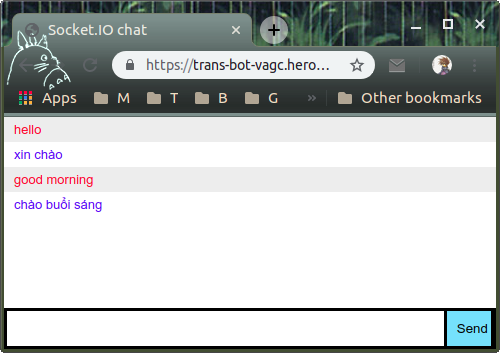

## This is the solution of Soicon team.

CÔNG BỐ ĐỀ THI ONLINE ROUND HACKATHON AI GRAND CHALLENGE

Ban tổ chức xin cảm ơn các bạn đã đăng ký tham gia thi hackathon Vietnam AI Grand Challenge 2019. Chúng tôi rất vui mừng vì cộng đồng AI tại Việt Nam đã hưởng ứng mạnh mẽ chuỗi chương trình này, với hơn 150 đội đã đăng kí cho 3 chương trình hackathon tại 3 thành phố.

Để đảm bảo cho phần tổ chức hackathon được diễn ra suôn sẻ, chúng tôi có chuẩn bị 1 bài thi chọn lọc để đảm bảo chất lượng thí sinh. Bài thi này sẽ được thực hiện, nộp bài online và được thông báo kết quả qua 1 Dashboard. Ngoài ra, các bạn cũng vui lòng cung cấp thêm các thông tin để hỗ trợ Ban tổ chức chuẩn bị cho hackathon được thuận lợi nhất.

🔸Vòng thi Online:
Đề bài: 
Thực hiện lập trình chatbot dịch từ tiếng Anh sang tiếng Việt trên nền tảng web application

Các yêu cầu kỹ thuật:
+ Trên HTML có 1 nút submit và 1 ô nhập cho người dùng
+ Tin nhắn của user thì class là me.
+ Tin nhắn của bot thì class là bot.
+ Bắt đầu conversation bằng tin nhắn của user (user nhắn trước)

Demo tham khảo: 
+ https://trans-bot-vagc.herokuapp.com/

Nộp bài:
+ Các đội thi deploy chatbot lên Heroku với app name là tên đội.
+ Submit bài nộp gồm link của chatbot và Bộ code nén file zip.
+ Link để nộp bài thi & Dashboard thông báo kết quả sẽ được gửi lại cho bạn qua email, cũng như trong group Facebook của chương trình vào ngày 19/06/2019

Hạn cuối nộp bài: 23 giờ 59 phút, ngày 26 tháng 06 năm 2019

🔸Thông tin đội thi:
Các đội vui lòng gửi lại thông tin của tất cả các cá nhân trong đội thi (theo như đã đăng kí qua platform Kambria) qua đường link dưới đây: 
http://bit.ly/Online_VAGC

Nếu có bất kì thắc mắc liên quan đến cuộc thi, vui lòng liên hệ với chúng tôi ngay lập tức để được giải đáp. Các thí sinh có thể tham gia group Facebook của chương trình để hỏi đáp, chia sẻ thông tin và giao lưu:

https://www.facebook.com/groups/VietnamAIGC/
------------
📌Các bạn vẫn có thể tiếp tục đăng ký để tham gia hackathon qua website: https://bounty.kambria.io/
Hạn chót đăng ký: 25/06/2019.

